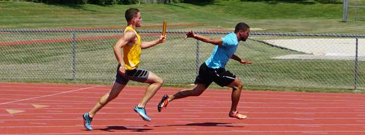

# `delay`

<p align="center">
  
</p>

**NOTE:** This is not an official Google project. It's an experimental
derivative of the
[`google.golang.org/appengine/delay`](https://google.golang.org/appengine/delay)
package. Where that package is intended for App Engine applications, this
package is intended to be used with Cloud Run.

-----

`delay` is a package that attempts to bring the simplicity of
`google.golang.org/appengine/delay` to Cloud Run apps, to make it simpler to
enqueue work to be handled later using Cloud Tasks.

## Prerequisites

You must create the Task Queue yourself, which requires creating an App Engine
application. That application and region must match the region where the Cloud
Run service is deployed.

## Usage

First, register your handler function. This must be done at init-time.

```
import "github.com/imjasonh/delay/pkg/delay"

var laterFunc = delay.Func("my-key", myFunc)
```

You can also use a function literal:

```
var laterFunc = delay.Func("my-key", func(ctx context.Context, some, args string) error {
	...
})
```

Before calling the function you should also initialize the package:

```
func init() {
	delay.Init()
}
```

Then, to call the function, invoke its `Call` method.

```
err := laterFunc.Call(ctx, req, queueName, delay.WithArgs("arg", "values"))
```

Each time the function is invoked, a Cloud Task will be enqueued which will be
handled by the specified handler function.

You can also schedule invocation for a time in the future with, for example,
`delay.WithDelay(time.Minute)`. This instructs the Cloud Tasks queue to invoke
the function one minute in the future.
